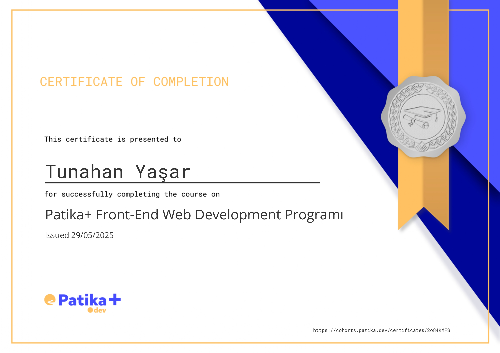

# 🚀 Patika+ 4 Months Front-End Web Developer Bootcamp

> &nbsp;
>  ## 🏅 Sertifika
> 
> Bootcamp sonunda başarıyla mezun olarak sertifika almaya hak kazandım.
> 
> 
> 
> [🔗 Sertifikamı Görüntüle](https://cohorts.patika.dev/certificates/2o84KMFS)
> &nbsp;

Bu repo, **Patika+ 4 Months Front-End Web Developer Bootcamp** sürecinde geliştirdiğim projeleri ve çalışmalarımı içermektedir.

---

## 🎓 Bootcamp Hakkında

- **Tarih Aralığı:** 27 Ocak 2025 - 27 Mayıs 2025 (4 ay)
- **Cohort:** Eğitimimize, "cohort" adı verilen offline platform ile asenkron bir şekilde başladık; sürecimiz, canlı dersler (Live Class) ile de desteklendi.
- **Süre:** 4 ay (16 hafta, toplam 126 gün)
- **Çalışma Süresi:** Ortalama 630 saat
- **Projeler:** 
    - 8  **react.js** projesi (3 tanesi final projesi olmak üzere), 
    - 4  **javascript** projesi,
    - 4 **bootstrap** projesi, 
    - 2 **tailwind** projesi, 
    - 5 **HTML & CSS** projesi

### 🎯 Etkinlikler
- 6 adet soft skill etkinliği
- 2 adet mezun sohbeti etkinliği
- 2 adet speed networking etkinliği
- 28 adet Live Class (canlı ders)

---

## 📚 Projeler 
Her projenin detaylı açıklaması ilgili klasörün README dosyasında yer almaktadır.

### ⚛️ React.js   
* #### Library App | [🔗 Repo](https://github.com/tunahanyasar/library-app-frontend) | [🌐 Live Demo](https://library-app-frontend-omega.vercel.app/)
  &nbsp;&nbsp; **3. ve Son Final Projesi.** Kütüphane yönetimi için geliştirilmiş React tabanlı bir uygulama. Kitap ve yazar yönetimi, ödünç alma gibi temel işlevler içerir.
* #### Question App | [🔗 Repo](https://github.com/tunahanyasar/question-app-reactjs) | [🌐 Live Demo](https://hafta-11-question-app.vercel.app/)
  &nbsp;&nbsp;**2. Final Projesi.** React ile hazırlanmış, kullanıcıya çoktan seçmeli sorular soran ve sonuçlarını gösteren bir quiz uygulaması.
* #### Sport Center | [🔗 Repo](https://github.com/tunahanyasar/sport-center-reactjs) | [🌐 Live Demo](https://sport-center-reactjs.vercel.app/)
  &nbsp;&nbsp;**1. Final Projesi.** Spor merkezi için hazırlanmış, üyelik, BMI hesaplama, ders programı ve yorumlar gibi özellikler sunan kapsamlı bir React uygulaması.
* #### Spend Money App | [🔗 Repo](https://github.com/tunahanyasar/spend-money-app-reactjs) | [🌐 Live Demo](https://spend-money-app-reactjs.vercel.app/)
  &nbsp;&nbsp;Kullanıcıya verilen sanal parayla çeşitli ürünler satın almasını sağlayan, harcama simülasyonu sunan React uygulaması.
* #### Star Wars Api | [🔗 Repo](https://github.com/tunahanyasar/star-wars-api-reactjs) | [🌐 Live Demo](https://star-wars-api-reactjs.vercel.app/)
  &nbsp;&nbsp;Star Wars API ile entegre çalışan, uzay gemileri ve karakterler hakkında bilgi sunan modern bir React uygulaması.
* #### Notes App | [🔗 Repo](https://github.com/tunahanyasar/notes-app-reactjs) | [🌐 Live Demo](https://notes-app-reactjs-omega.vercel.app/)
  &nbsp;&nbsp;React ile component yapısı kullanılarak hazırlanmış, kullanıcıların not ekleyip düzenleyebildiği basit ve modern bir not alma uygulaması.
* #### Dice Game | [🔗 Repo](https://github.com/tunahanyasar/dice-game-reactjs) | [🌐 Live Demo](https://dice-game-reactjs-gilt.vercel.app/)
  &nbsp;&nbsp;React ve Vite ile geliştirilmiş, iki oyunculu, modern ve tamamen responsive bir zar oyunu. Kullanıcılar isimlerini değiştirebilir, animasyonlu zar atabilir ve anlık sonuçları görebilirler.
* #### Todo App | [🔗 Repo](https://github.com/tunahanyasar/todo-app-reactjs) | [🌐 Live Demo](https://todo-app-reactjs-flame.vercel.app/)
  &nbsp;&nbsp;Yapılacaklar listesi oluşturmak ve yönetmek için React ile hazırlanmış, kullanıcı dostu bir uygulama.

### :yellow_circle: JavaScript  
* #### Asian Kitchen Menu | [🔗 Repo](https://github.com/tunahanyasar/asian-kitchen-s-menu) | [🌐 Live Demo](https://asian-kitchen-s-menu.vercel.app/)
  &nbsp;&nbsp;JavaScript ile dinamik olarak oluşturulan, kategori filtreleme ve Bootstrap 4 ile responsive tasarım sunan bir restoran menü uygulaması.

* #### Sport Center Vanillajs | [🔗 Repo](https://github.com/tunahanyasar/Hafta-8-Sport-Center) | [🌐 Live Demo](https://warm-pixie-710995.netlify.app/)
  &nbsp;&nbsp; Spor merkezi için vanilla JS ile hazırlanmış, üyelik, BMI hesaplama ve ders programı gibi temel işlevler sunan web uygulaması.
* #### Clock Javascript | [🔗 Repo](https://github.com/tunahanyasar/clock-javascript) | [🌐 Live Demo](https://clock-javascript-sepia.vercel.app/)
  &nbsp;&nbsp;Kullanıcıdan isim alıp ekrana yazan ve gerçek zamanlı dijital saat gösteren, Bootstrap ile şıklaştırılmış bir JavaScript uygulaması.
* #### Todo List Js | [🔗 Repo](https://github.com/tunahanyasar/todo-list-js) | [🌐 Live Demo](https://todo-list-js-wheat.vercel.app/)
  &nbsp;&nbsp;Vanilla JS ile yapılmış, yapılacaklar ekleyip tamamlananları işaretleyebileceğiniz basit bir todo list uygulaması.

### :purple_circle: Bootstrap 
* #### Blog Istanbul Tour | [🔗 Repo](https://github.com/tunahanyasar/blog-istanbul-tour-bootstrap) | [🌐 Live Demo](https://blog-istanbul-tour-bootstrap.vercel.app/)
  &nbsp;&nbsp;İstanbul turu temalı, Bootstrap 4 ile responsive ve modern bir blog sitesi. Kategoriler, kartlar ve sabit yan menü içerir.
* #### Instagram Clone | [🔗 Repo](https://github.com/tunahanyasar/instagram-clone-bootstrap) | [🌐 Live Demo](https://instagram-clone-bootstrap-three.vercel.app/)
  &nbsp;&nbsp;Gerçek Instagram arayüzüne benzer, Bootstrap 4 ile responsive olarak hazırlanmış sosyal medya klonu.
* #### Linkedin Clone | [🔗 Repo](https://github.com/tunahanyasar/linkedin-clone-bootstrap) | [🌐 Live Demo](https://linkedin-clone-bootstrap.vercel.app/)
  &nbsp;&nbsp;LinkedIn ana sayfasının Bootstrap 4 ile responsive olarak klonlandığı, sabit chat ve aside bölümleri içeren bir proje.
* #### Iphone15pro Landing Page | [🔗 Repo](https://github.com/tunahanyasar/iphone15pro-landing-page) | [🌐 Live Demo](https://iphone15pro-landing-page-ten.vercel.app/)
  &nbsp;&nbsp;Apple'ın iPhone 15 Pro tanıtım sayfasından esinlenerek Bootstrap 5 ve çeşitli kütüphanelerle hazırlanmış modern bir landing page.

### 🌊 TailwindCSS 
* #### Landing Page Tailwind | [🔗 Repo](https://github.com/tunahanyasar/landing-page-tailwind) | [🌐 Live Demo](https://landing-page-tailwind-alpha.vercel.app/)
  &nbsp;&nbsp;TailwindCSS ile hazırlanmış, modern ve tek sayfa bir açılış (landing) sayfası. Responsive ve şık bir tasarıma sahiptir.
* #### Review Page Tailwind | [🔗 Repo](https://github.com/tunahanyasar/review-page-tailwind) | [🌐 Live Demo](https://review-page-tailwind.vercel.app/)
  &nbsp;&nbsp;Kullanıcı yorumlarını modern ve responsive şekilde listeleyen, TailwindCSS ile hazırlanmış bir sayfa.

### 📝 HTML & CSS   
* #### Survey Form | [🔗 Repo](https://github.com/tunahanyasar/survey-form-html) | [🌐 Live Demo](https://survey-form-html-psi.vercel.app/)
  &nbsp;&nbsp;HTML ile hazırlanmış, kullanıcıdan bilgi toplayan basit ve erişilebilir bir anket formu.
* #### Tribute Website George Orwell | [🔗 Repo](https://github.com/tunahanyasar/tribute-website-george-orwell) | [🌐 Live Demo](https://tribute-website-george-orwell.vercel.app/)
  &nbsp;&nbsp;George Orwell için hazırlanan, biyografi ve kitap tanıtımları içeren kişisel/tribute web sitesi.
* #### Blog Page Istanbul Tour | [🔗 Repo](https://github.com/tunahanyasar/blog-page-istanbul-tour) | [🌐 Live Demo](https://blog-page-istanbul-tour.vercel.app/)
  &nbsp;&nbsp;İstanbul turu için temel HTML ve CSS ile hazırlanmış, iki sayfalı, semantik etiketler ve modern web tasarım ilkeleriyle geliştirilmiş blog sayfası.
* #### First Website | [🔗 Repo](https://github.com/tunahanyasar/first-website-html)
  &nbsp;&nbsp;Temel HTML ve CSS ile hazırlanmış, semantik etiketler ve düzenli içerik yapısı sunan bir blog sayfası.
* #### Guide Website | [🔗 Repo](https://github.com/tunahanyasar/guide-website-html) | [🌐 Live Demo](https://guide-website-html.vercel.app/)
  &nbsp;&nbsp;Çoklu sayfa yapısı, form ve modern CSS ile hazırlanmış bir rehber/kılavuz sitesi.
* #### Summary | [🔗 Repo](https://github.com/tunahanyasar/summary-html) | [🌐 Live Demo](https://summary-html.vercel.app/)
  &nbsp;&nbsp;Kişisel özet ve proje tanıtım sayfası olarak hazırlanmış, sade ve anlaşılır bir HTML/CSS projesi.

---

## 🛠️ Nasıl Kullanılır?

1. İlgilendiğiniz klasöre girin.
2. Proje dokümantasyonunu (varsa) ve README dosyalarını inceleyin.
3. HTML/CSS/JS projeleri için `index.html` dosyasını tarayıcıda açabilirsiniz.
4. React.js projeleri için ilgili klasörde `npm install` ve ardından `npm run dev` komutlarını kullanarak projeyi başlatabilirsiniz.

---

## 📞 İletişim

[Tunahan Yaşar](https://github.com/tunahanyasar)

* GitHub: [@tunahanyasar](https://github.com/tunahanyasar)
* LinkedIn: [Tunahan Yaşar](https://www.linkedin.com/in/tunahan-yasar/) 